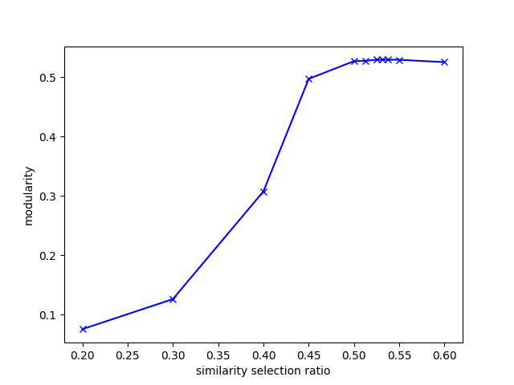

# Advanced data mining project

## Quick start
```bash
# Unzip data
./setup.sh
# Install dependencies
pip3 install -r requirements.txt

# Run project
python3 communityDetection.py -n ./data/TC1-1/1-1.dat
python3 evaluation.py -n ./data/TC1-1/1-1.dat
```


## Options
### communityDetection.py
- `n`: dataset
- `m`: method - you can choose between `scan`(default) and `louvain`
- `o`: output community file location
```bash
python3 communityDetection.py -n ./data/TC1-6/1-6.dat
# This command is equal to command below
python3 communityDetection.py -n ./data/TC1-6/1-6.dat -m scan -e 0.25 -c 3 -o ./data/TC1-6/1-6.cmty 
```

### evaluation.py
- `n`: dataset
- `r`: resulting community file from communityDetection.py
```bash
python3 evaluation.py -n ./data/TC1-6/1-6.dat
# This command is equal to command below
python3 evaluation.py -n ./data/TC1-6/1-6.dat -r ./data/TC1-6/1-6.cmty 
```

## Algorithm

### 1. Find $\mu$ value
First, calcuatie all similarity values from neighboring nodes in network.
If the number of k-th largest similarity of one node to its neighbors > 0.01 exceeds 75% of total nodes, k will be selected as $\mu$ value.

### 2. Find $\epsilon$ value
It finds optimal epsilon value by maximizing modularity value.


You can see the experiment result in [result](./fig/result.txt)

It selects value from sorted list of k-th similarities at r. For example, if r = 0.6 and similarity list is length of 100, then 0.5 * 100 = 60th value of similarity will be selected as epsilon. Then, it calculates modularity from the result.

First, it search from 0.1, 0.2, ..., 0.9. If modularity decreases, it selects the highest point. After that, it uses binary search in interval [best_point - 0.1, best_point + 0.1] to find optimal point.